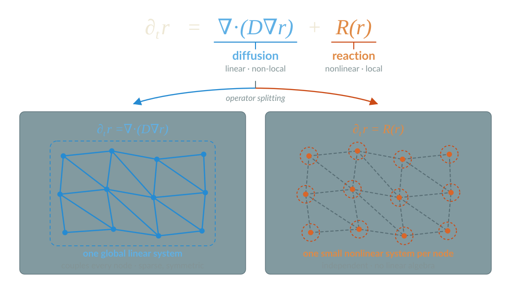
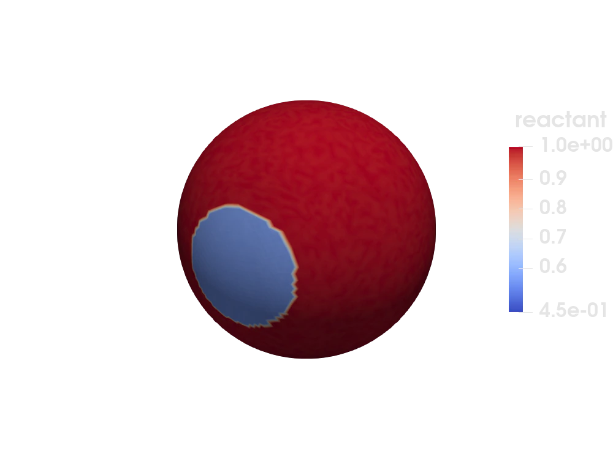
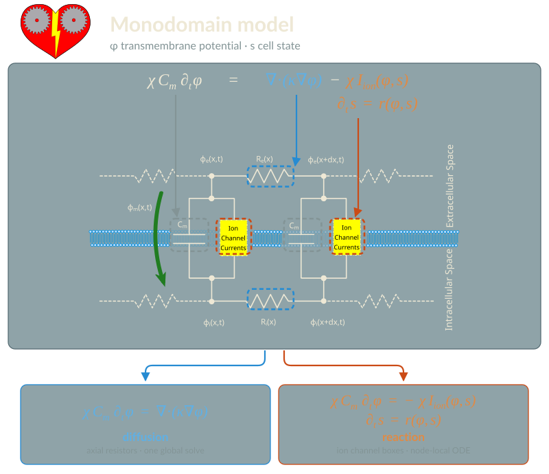
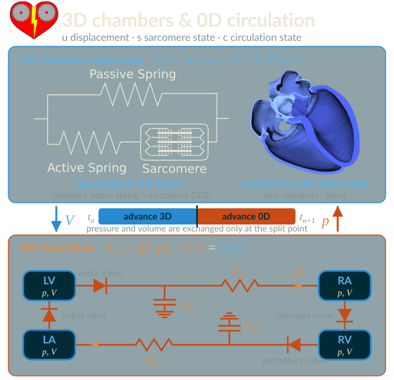
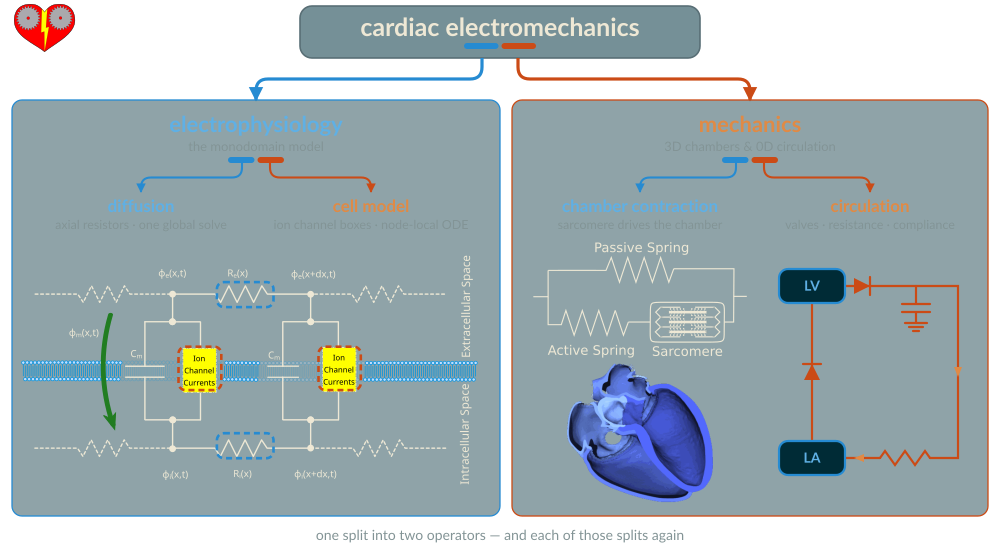

# Where Operator Splitting hides in Real World Applications

## Reaction Diffusion Systems

{width="88%" fig-align="center"}

. . .

Equation family is widely used (morphogenesis, chemistry, electrophysiology, ...)

## Turing Patterns

Gray-Scott on a sphere

::: {.columns}
::: {.column width="40%"}
$$
\begin{aligned}
\partial_t r_1 &= D_1 \Delta r_1 \;\underbrace{-\, r_1 r_2^2 + F(1 - r_1)}_{R_1(r_1, r_2)} \\
\partial_t r_2 &= D_2 \Delta r_2 \;\underbrace{+\, r_1 r_2^2 - (F + k)\, r_2}_{R_2(r_1, r_2)}
\end{aligned}
$$

* Linear lagrange triangles on an embedded surface ( Ferrite.jl )
* System of equations -- nothing changes for the splitting
:::
::: {.column width="60%"}
<!-- TODO asset: gif/webp rendered from demos/turing-patterns/reactive-surface.vtkhdf -->

:::
:::

::: {.footer}
after the [Ferrite.jl reactive surface tutorial](https://ferrite-fem.github.io/Ferrite.jl/stable/tutorials/reactive_surface/)
:::

## You have written this splitting before

Semi-discrete form — reaction evaluated node-wise, so it never sees $\mathbf{M}$:

$$
\mathbf{M}\dot{\mathbf{r}} = -\mathbf{K}\mathbf{r}
\qquad\text{and}\qquad
\dot{\mathbf{r}} = \mathbf{R}(\mathbf{r})
$$

```julia
W = M + Δt * K
cholW = cholesky(W)                      # constant → factorize once
for t in Δt:Δt:T
    uₜ .= cholW \ (M * uₜ₋₁)             # implicit Euler on diffusion
    for i in 1:num_nodes                 # explicit Euler on reaction
        du = reaction_kernel(rvₜ[:, i], material, t)
        rvₜ[:, i] .+= Δt .* du
    end
    uₜ₋₁ .= uₜ
end
```

. . .

That loop **is** Lie-Trotter-Godunov with using backward and forward Euler hardcoded.

## The same scheme, declared

```julia
diffusion = ODEFunction(MatrixOperator(diffusion_matrix);
                        mass_matrix, jac_prototype = diffusion_matrix)
reaction  = ODEFunction(GrayScottReactionFunction())        # node-local kernel

f    = GenericSplitFunction((diffusion, reaction), (1:ndofs(dh), 1:ndofs(dh)))
prob = OperatorSplittingProblem(f, u₀, (0.0, T))

solve(prob, LieTrotterGodunov((ImplicitEuler(linsolve = UMFPACKFactorization()),
                               Euler())), dt = Δt)
```

* Same operations, comparable cost
* Factorization recycling now handled via `ImplicitEuler`
* We can now quickly chance schemes and compare them

Now change the scheme!

```julia
# second order scheme with 3 stages
solve(prob, StrangMarchuk((SDIRK2(linsolve = UMFPACKFactorization()), Heun())), dt = Δt)

# adaptive second order with 4 stages
solve(prob, PalindromicPairLieTrotterGodunov((SDIRK2(linsolve = UMFPACKFactorization()), Heun()), dt = Δt))
```

Performance is not there yet for the adaptive scheme. :(

## Cardiac Electrophysiology

::: {.columns}
::: {.column width="65%"}
{width="100%" fig-align="center"}
:::
::: {.column width="35%"}
{width="90%" fig-align="center"}

* Structurally the *same* split — only the reaction kernel changes
* The reaction is extremely expensive (plethora of states per node)
:::
:::

## ECG Simulations

<!-- Relate electrical signals in the heart and measured signals on the body in silico -->

{width="100%" fig-align="center"}

::: {.footer}
Credits to my student Abdulaziz for setting up the simulation
:::

## Cardiac Mechanics with Blood Flow

::: {.columns}
::: {.column width="62%"}
{width="100%" fig-align="center"}
:::
::: {.column width="38%"}
{width="76%" fig-align="center"}

* The 3D chamber and the 0D circuit exchange only pressure and volume
* Each sub-problem keeps its own solver
:::
:::


## Cardiac Electromechanics

{width="96%" fig-align="center"}

## Seismocardiography Simulations


::: {.footer}
Credits to my student Abdulaziz for setting up the simulation and the DFG funding
:::


<!-- Local Variables: -->
<!-- mode: markdown -->
<!-- End: -->
