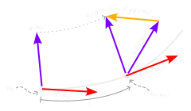

# Table of Contents
* Theory of Operator Splitting
* Implimentation of OrdinaryDiffEqOperatorSplitting.jl
* Examples/demo

## Motivation

* Suppose we want to solve

$$
\frac{du}{dt} = f(u, t) + g(u, t) \\
$$

* The combined field we actually have to integrate is complicated

## Motivation (continued)

* But it splits into two pieces that are each simple

## LieTrotterGodunov

* The obvious method
* Evaluate `u_{n+1} = u{n} + dt*(f(u, t) + g(u, t))`
* Basically `ExplicitEuler`

## Truncation errors

* The fundamental difficulty of Operator Splitting is truncation error
* LieTrotterGodunov limited to order 1

* To get high order solvers you need to build multistage meta-integrators.

## Strang Splitting
* half-step f, full step g, half step f
* This gets us to order 2
* This is as far as most packages go

## Higher order schemes
* Require either reversing time or imaginary time.
* Very tricky, can create instability or rotate eigenvalues
* A-stable integrators very helpful here

<-- TODO: picture explaining complex stepping. -->

<!-- Local Variables: -->
<!-- mode: markdown -->
<!-- End: -->
